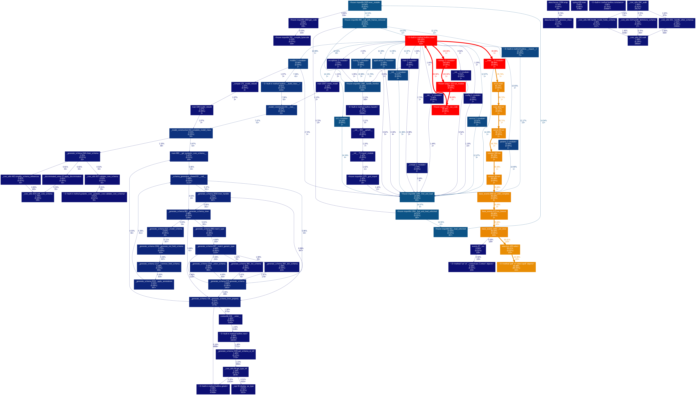
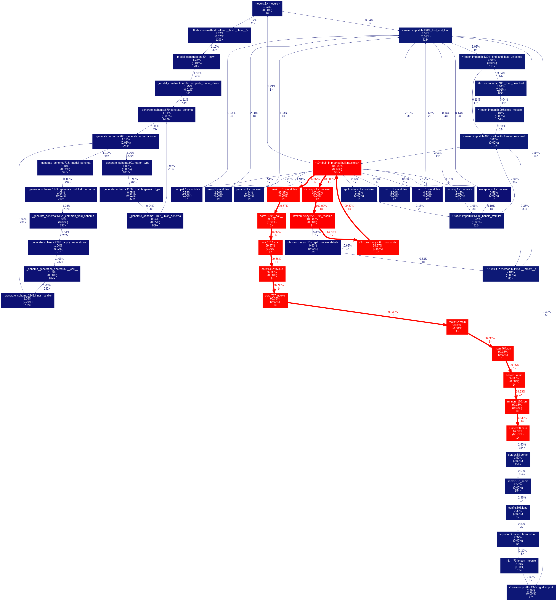

# cProfile

Python に含まれている決定論的プロファイラになる。
関数ごとに呼び出し関数や処理時間を計測する。

[redfish-service-py](https://github.com/9506hqwy/redfish-service-py) を使って確認する。

## プロファイル

プロファイラを有効にしてサービスを起動する。

```sh
uv run python -m cProfile -o profile.pstat -m redfish_service
```

アクセス後にサービスを停止する。

```sh
curl -u admin:admin -i http://127.0.0.1:8000/redfish/v1/SessionService/Sessions
```

累積時間が長い上位 10 関数を表示する。

```python
>>> import pstats
>>> pstats.Stats('profile.pstat').strip_dirs().sort_stats('cumtime').print_stats(10)
Mon Dec 30 01:43:52 2024    profile.pstat

         1192489 function calls (1057019 primitive calls) in 4.834 seconds

   Ordered by: cumulative time
   List reduced from 3250 to 10 due to restriction <10>

   ncalls  tottime  percall  cumtime  percall filename:lineno(function)
    420/1    0.019    0.000    4.835    4.835 {built-in method builtins.exec}
        1    0.000    0.000    4.835    4.835 <string>:1(<module>)
        1    0.000    0.000    4.835    4.835 <frozen runpy>:201(run_module)
        1    0.000    0.000    4.834    4.834 <frozen runpy>:65(_run_code)
        1    0.000    0.000    4.834    4.834 __main__.py:1(<module>)
        1    0.000    0.000    4.145    4.145 cli.py:21(main)
        1    0.000    0.000    4.145    4.145 main.py:463(run)
        1    0.000    0.000    4.144    4.144 server.py:64(run)
        1    0.000    0.000    4.143    4.143 runners.py:160(run)
        3    0.000    0.000    4.143    1.381 base_events.py:684(run_until_complete)


<pstats.Stats object at 0x7f43cb130a50>
```

可視化する。

```sh
apt install graphviz
uv pip install gprof2dot
```

プロファイル結果をグラフにする。

```sh
uv run gprof2dot -f pstats profile.pstat | dot -T png -o profile.png
```

結果は以下となる。



## 非同期コードのプロファイル

下記のコードで確認する。

```python
import asyncio
from fastapi import FastAPI

app = FastAPI()


@app.get("/")
async def hello_world():
    await asyncio.sleep(5)
    return {"Hello": "World"}
```

サーバを起動する。

```sh
python -m cProfile -o profile.pstat -m uvicorn --host 0.0.0.0 main:app
```

3回リクエストする。

```sh
ab -n 3 -c 3 http://127.0.0.1:8000/
```

`hello_world` メソッドではカウントされない。

```sh
>>> import pstats
>>> pstats.Stats('profile.pstat').strip_dirs().sort_stats('filename').print_stats('main.py')
Thu Apr 24 11:40:30 2025    profile.pstat

         779648 function calls (750481 primitive calls) in 15.565 seconds

   Ordered by: file name
   List reduced from 3067 to 12 due to restriction <'main.py'>

   ncalls  tottime  percall  cumtime  percall filename:lineno(function)
        1    0.000    0.000   15.466   15.466 main.py:62(main)
        1    0.000    0.000   15.466   15.466 main.py:464(run)
        4    0.000    0.000    0.432    0.108 main.py:1(<module>)
        2    0.000    0.000    0.027    0.014 main.py:1682(create_model)
        3    0.000    0.000    0.024    0.008 main.py:592(model_rebuild)
        1    0.000    0.000    0.000    0.000 main.py:121(BaseModel)
       40    0.000    0.000    0.000    0.000 main.py:829(__pydantic_init_subclass__)
        1    0.000    0.000    0.000    0.000 main.py:243(__init__)
        6    0.000    0.000    0.000    0.000 main.py:7(hello_world)
        1    0.000    0.000    0.000    0.000 main.py:18(Change)
        1    0.000    0.000    0.000    0.000 main.py:591(__getattr__)
        1    0.000    0.000    0.000    0.000 main.py:48(print_version)


<pstats.Stats object at 0x7fb2ab92eb10>
```



## 参考

- [Python プロファイラ](https://docs.python.org/ja/3/library/profile.html)
