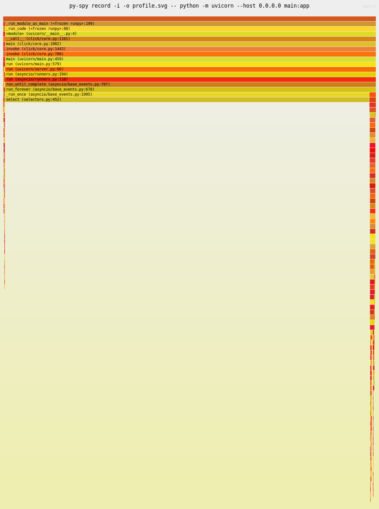

# py-spy

CPU の統計的プロファイラになる。
実行中のプロセス ID にアタッチできる。

[redfish-service-py](https://github.com/9506hqwy/redfish-service-py) を使って確認する。

## インストール

インストールする。

```sh
uv pip install py-spy
```

## プロファイル

プロファイラを有効にしてサービスを起動する。

```sh
uv run py-spy record -o profile.svg -- python -m redfish_service
```

アクセス後にサービスを停止する。

```sh
curl -u admin:admin -i http://127.0.0.1:8000/redfish/v1/SessionService/Sessions
```

下記が出力される。


## 非同期コードのプロファイル

下記のコードで確認する。

```python
import asyncio
from fastapi import FastAPI

app = FastAPI()


@app.get("/")
async def hello_world():
    await asyncio.sleep(5)
    return {"Hello": "World"}
```

サーバを起動する。`-i` を指定する。

```sh
py-spy record -i -o profile.svg -- python -m uvicorn --host 0.0.0.0 main:app
```

3回リクエストする。

```sh
ab -n 3 -c 3 http://127.0.0.1:8000/
```

`hello_world` メソッドは出力されない。


