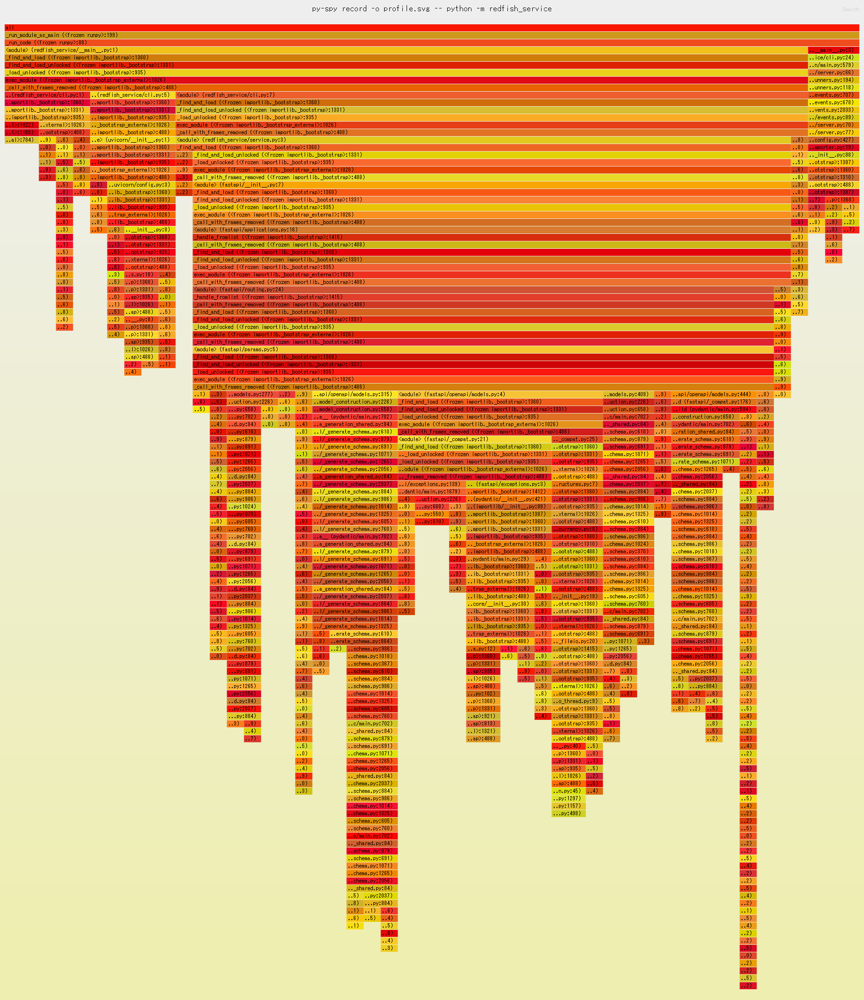

# py-spy

CPU の統計的プロファイラになる。
実行中のプロセス ID にアタッチできる。

[redfish-service-py](https://github.com/9506hqwy/redfish-service-py) を使って確認する。

## インストール

インストールする。

```sh
uv pip install py-spy
```

## プロファイル

プロファイラを有効にしてサービスを起動する。

```sh
uv run py-spy record -o profile.svg -- python -m redfish_service
```

アクセス後にサービスを停止する。

```s
curl -u admin:admin -i http://127.0.0.1:8000/redfish/v1/SessionService/Sessions
```

下記が出力される。


