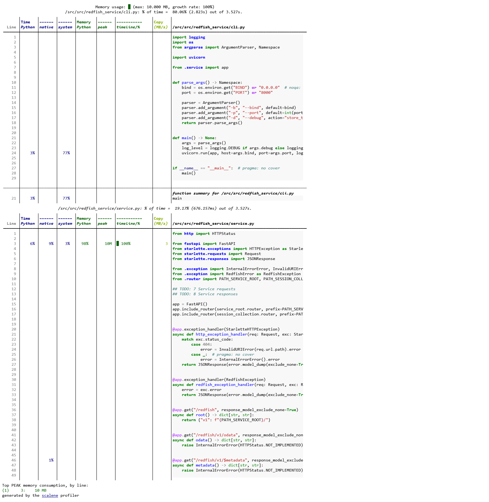

# scalene

CPU, GPU, メモリの統計的プロファイラになる。
行レベルで結果が表示される。

[redfish-service-py](https://github.com/9506hqwy/redfish-service-py) を使って確認する。

## インストール

インストールする。

```sh
uv pip install scalene
```

## プロファイル

プロファイラを有効にしてサービスを起動する。

```sh
uv run scalene --outfile profile.html --html --no-browser -m redfish_service
```

アクセス後にサービスを停止する。

```sh
curl -u admin:admin -i http://127.0.0.1:8000/redfish/v1/SessionService/Sessions
```

下記が出力される。



## 非同期コードのプロファイル

下記のコードで確認する。

```python
import asyncio
from fastapi import FastAPI

app = FastAPI()


@app.get("/")
async def hello_world():
    await asyncio.sleep(5)
    return {"Hello": "World"}
```

サーバを起動する。`--profile-all` を指定する。

```sh
scalene --outfile profile.html --html --no-browser --profile-all -m uvicorn --host 0.0.0.0 main:app
```

3回リクエストする。

```sh
ab -n 3 -c 3 http://127.0.0.1:8000/
```

`main.py` が出力されない。
