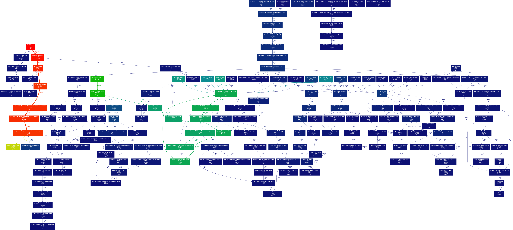
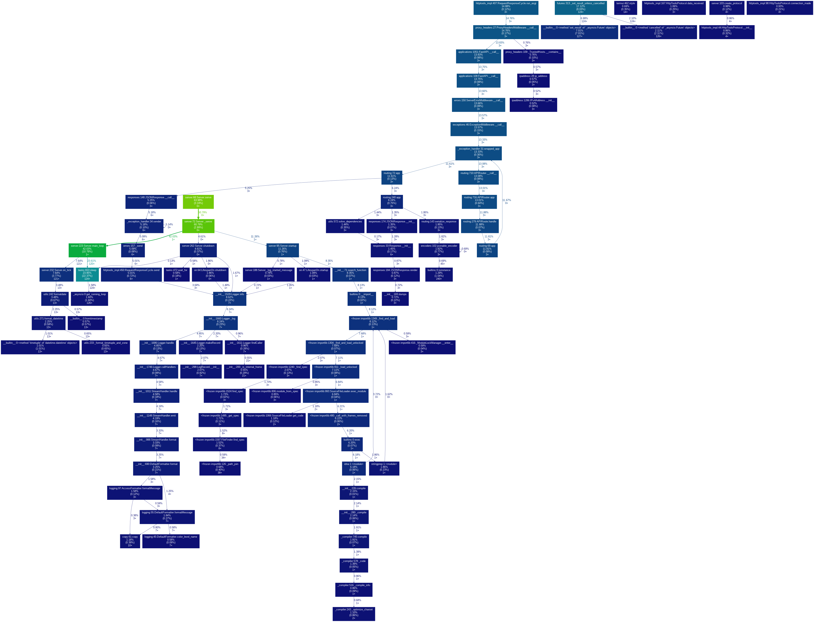
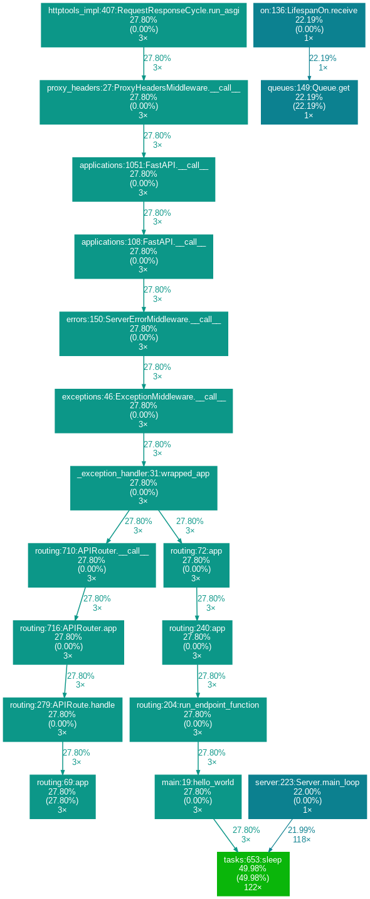

# yappi

CPU の決定論的プロファイラになる。
CPU 時間と経過時間を分けて計測できる。

[redfish-service-py](https://github.com/9506hqwy/redfish-service-py) を使って確認する。

## インストール

インストールする。

```sh
uv pip install yappi
```

## プロファイル

ソースコードに CPU 時間を計測する処理を追加する。
測定結果は pstat 形式で保存する。

```patch
diff --git a/src/redfish_service/cli.py b/src/redfish_service/cli.py
index 9ace85e..8026f15 100644
--- a/src/redfish_service/cli.py
+++ b/src/redfish_service/cli.py
@@ -34,7 +34,15 @@ def main() -> None:
         )

     init_instances()
-    uvicorn.run(app, host=args.bind, port=args.port, log_level=log_level)
+
+    import yappi
+    try:
+        yappi.set_clock_type("cpu")
+        with yappi.run():
+            uvicorn.run(app, host=args.bind, port=args.port, log_level=log_level)
+    finally:
+        stats = yappi.get_func_stats()
+        stats.save('profile.pstat', 'pstat')


 if __name__ == "__main__":  # pragma: no cover
```

サービスを起動する。

```sh
uv run redfish-service
```

アクセス後にサービスを停止する。

```sh
curl -u admin:admin -i http://127.0.0.1:8000/redfish/v1/SessionService/Sessions
```

累積時間が長い上位 10 関数を表示する。

```python
>>> import pstats
>>> pstats.Stats('profile.pstat').strip_dirs().sort_stats('cumtime').print_stats(10)
Tue Apr 22 12:06:05 2025    profile.pstat

         18819 function calls (19273 primitive calls) in 0.094 seconds

   Ordered by: cumulative time
   List reduced from 975 to 10 due to restriction <10>

   ncalls  tottime  percall  cumtime  percall filename:lineno(function)
        1    0.000    0.000    0.133    0.133 main.py:464(run)
        1    0.000    0.000    0.131    0.131 server.py:64(Server.run)
        1    0.000    0.000    0.128    0.128 runners.py:160(run)
        3    0.000    0.000    0.127    0.042 base_events.py:655(_UnixSelectorEventLoop.run_until_complete)
        3    0.001    0.000    0.127    0.042 base_events.py:631(_UnixSelectorEventLoop.run_forever)
        1    0.000    0.000    0.126    0.126 runners.py:86(Runner.run)
      244    0.011    0.000    0.126    0.001 base_events.py:1922(_UnixSelectorEventLoop._run_once)
      277    0.002    0.000    0.097    0.000 events.py:86(Handle._run)
        1    0.001    0.001    0.068    0.068 server.py:68(Server.serve)
        1    0.001    0.001    0.067    0.067 server.py:72(Server._serve)


<pstats.Stats object at 0x7f85e59e9ca0>
```

可視化する。

```sh
apt install graphviz
uv pip install gprof2dot
```

プロファイル結果をグラフにする。

```sh
uv run gprof2dot -f pstats profile.pstat | dot -T png -o profile.png
```

結果は以下となる。



## 非同期コードのプロファイル

下記のコードで確認する。

```python
import asyncio
from contextlib import asynccontextmanager
from fastapi import FastAPI
import yappi


@asynccontextmanager
async def lifespan(app: FastAPI):
    yappi.set_clock_type("cpu") # or "wall"
    yappi.start(builtins=True)
    yield
    yappi.stop()
    yappi.get_func_stats().save('profile.pstat', 'pstat')


app = FastAPI(lifespan=lifespan)


@app.get("/")
async def hello_world():
    await asyncio.sleep(5)
    return {"Hello": "World"}
```

サーバを起動する。

```sh
uvicorn --host 0.0.0.0 main:app
```

3回リクエストする。

```sh
ab -n 3 -c 3 http://127.0.0.1:8000/
```

クロックタイプが `cpu` の場合は `hello_world` メソッドではカウントされない。

```python
>>> import pstats
>>> pstats.Stats('profile.pstat').strip_dirs().sort_stats('filename').print_stats('main.py')
Thu Apr 24 13:25:33 2025    profile.pstat

         3594 function calls (3631 primitive calls) in 0.033 seconds

   Ordered by: file name
   List reduced from 416 to 2 due to restriction <'main.py'>

   ncalls  tottime  percall  cumtime  percall filename:lineno(function)
        3    0.000    0.000    0.000    0.000 main.py:19(hello_world)
      0/1    0.000             0.000    0.000 main.py:7(lifespan)


<pstats.Stats object at 0x7f4183b8ddf0>
```



クロックタイプが `wall` の場合は `hello_world` メソッドに `sleep` も含まれる。

```python
>>> import pstats
>>> pstats.Stats('profile.pstat').strip_dirs().sort_stats('filename').print_stats('main.py')
Thu Apr 24 13:31:54 2025    profile.pstat

         3575 function calls (3612 primitive calls) in 53.960 seconds

   Ordered by: file name
   List reduced from 416 to 2 due to restriction <'main.py'>

   ncalls  tottime  percall  cumtime  percall filename:lineno(function)
        3    0.000    0.000   15.000    5.000 main.py:19(hello_world)
      0/1    0.000             0.000    0.000 main.py:7(lifespan)


<pstats.Stats object at 0x7f064ce71e20>
```


